

# Portal Berita - Laravel CRUD App

Deskripsi: projek laravel sederhana berbasis laravel dengan fitur autentikasi dan CRUD (Create, Read, Update, Delete) untuk mengelola konten berita.

## Fitur
- Register dan Login (Autentikasi)
- Tambah berita (Create)
- Tampilkan berita di Beranda (Read)
- Edit berita (Update)
- Hapus berita (Delete)

## Screenshot

### Halaman Home
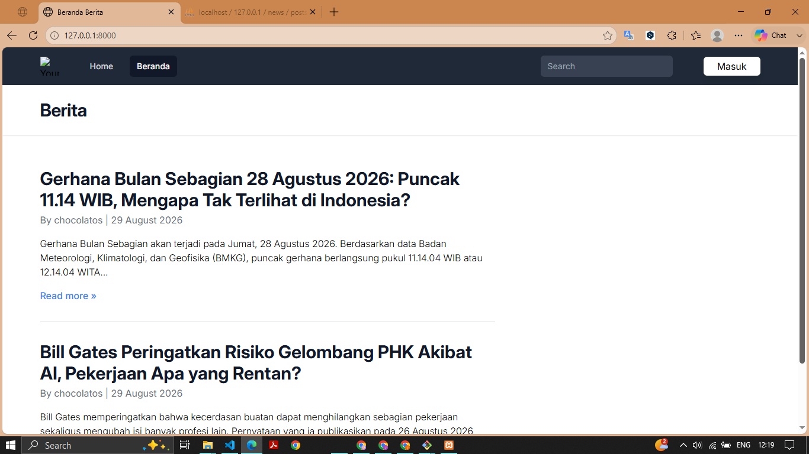

### Halaman Readmore Berita
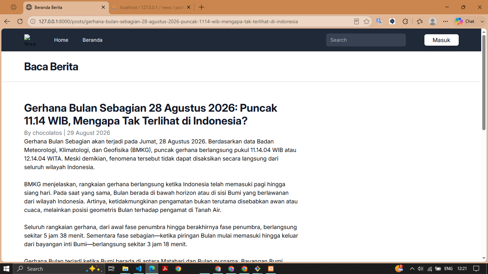

### Halaman Register
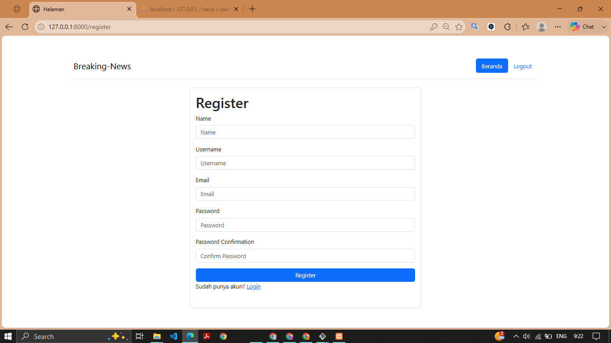

### Halaman Login
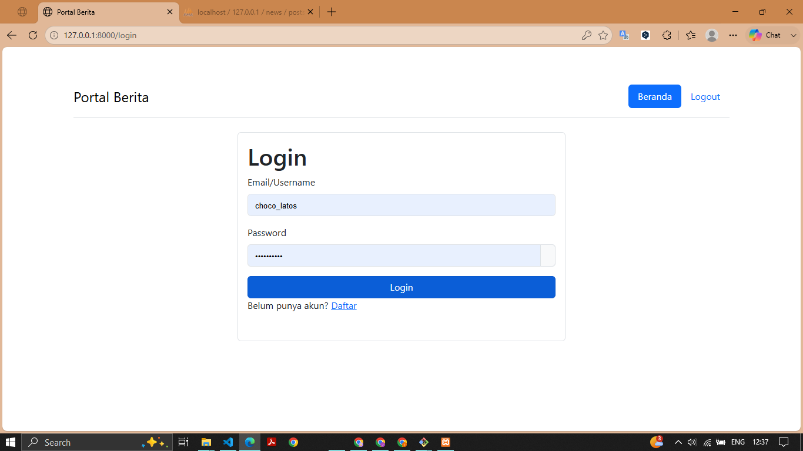

### Halaman Menu
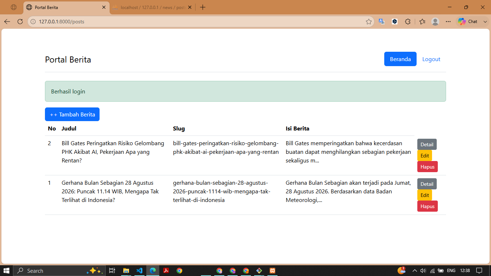

### Halaman Create Berita
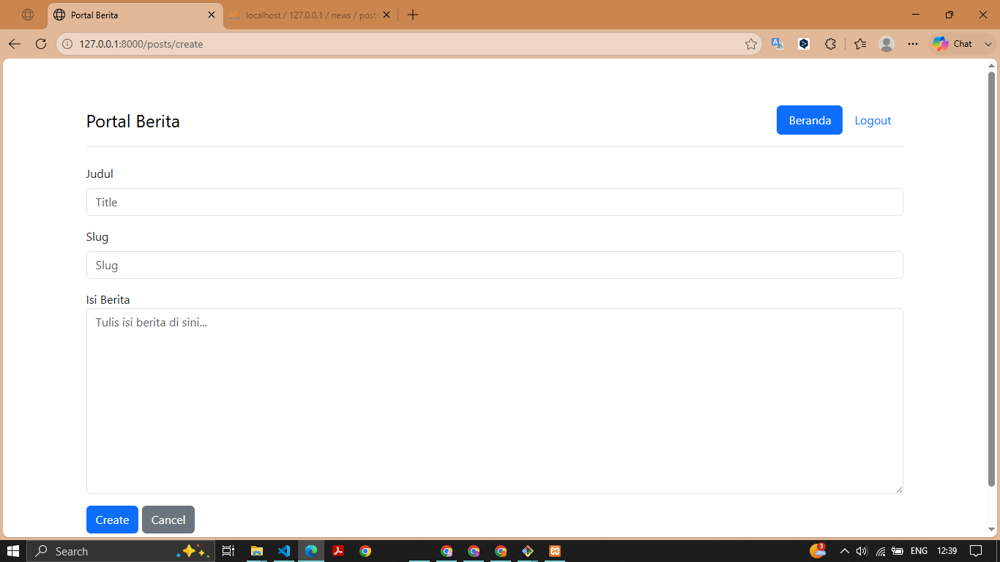

### Halaman Detail Berita
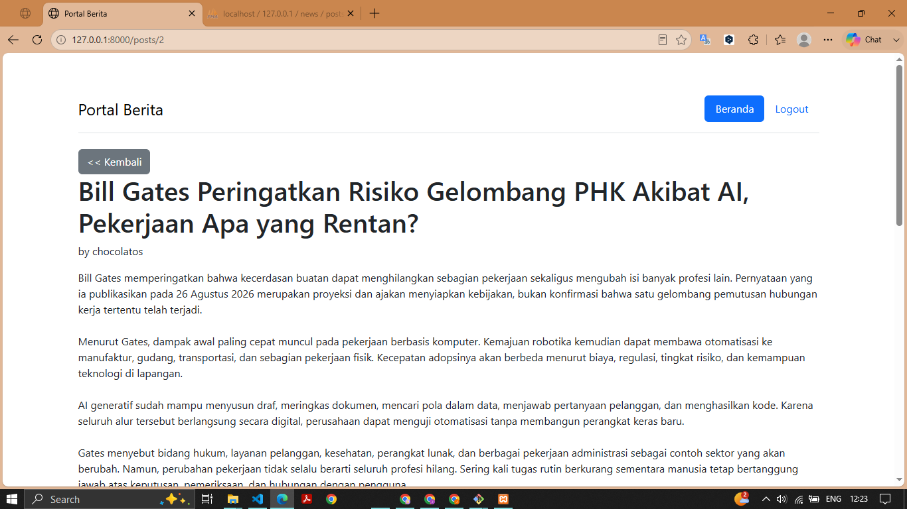

### Halaman Edit Berita
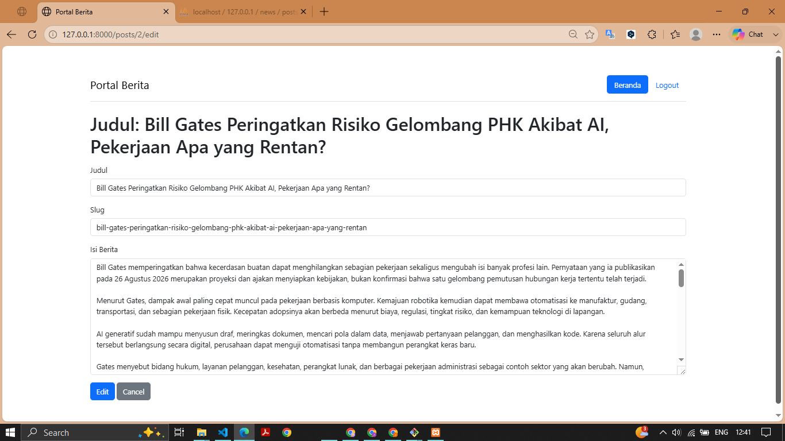

### Halaman Delete Berita
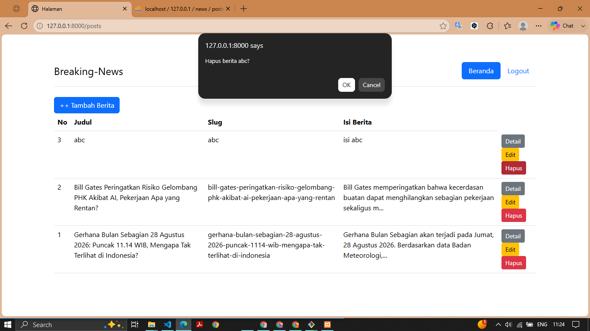

### Database: news
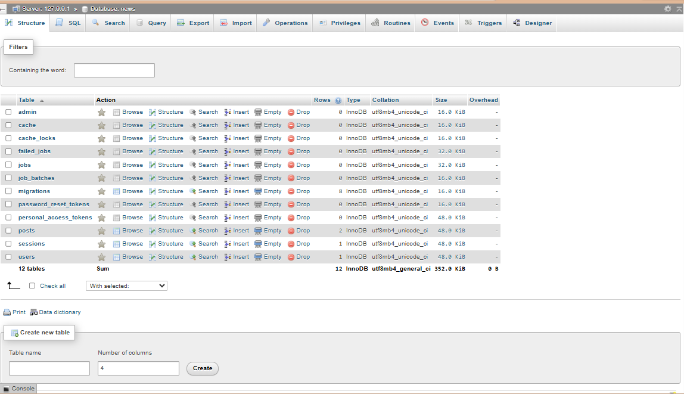

### Table: posts
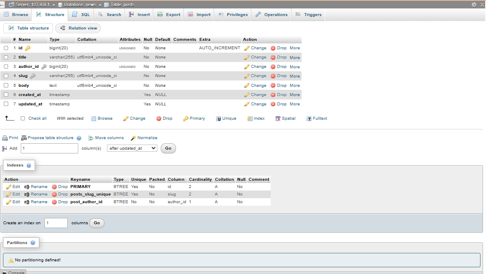
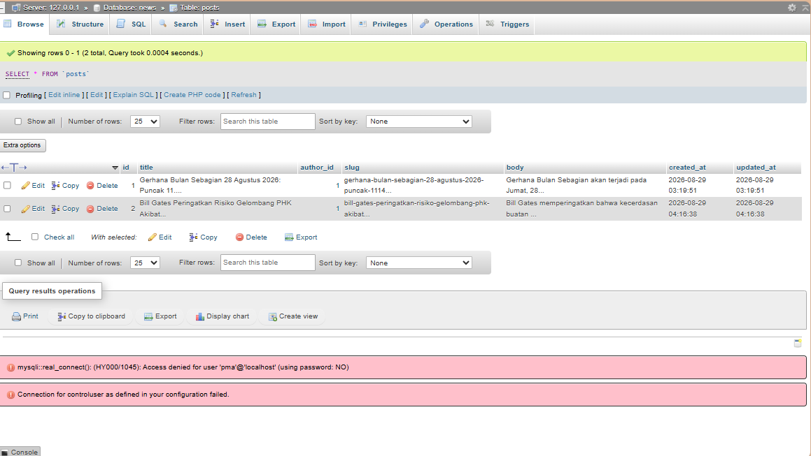
